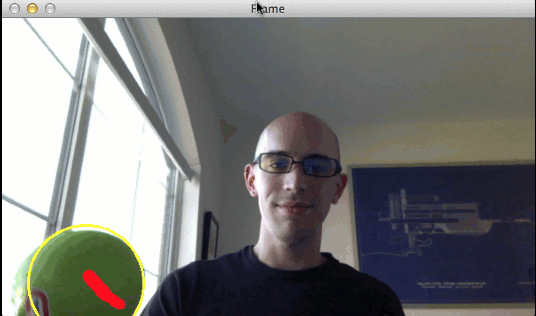

# Color Based Ball Tracking With OpenCV
### detects and tracks ball in the video based on its color

Amazing simple ball tracker based on its color. (Used green color in this project)

All thanks to Adrian Rosebrock (from [pyimagesearch](https://www.pyimagesearch.com/)) for making
great tutorials. This project is inspired from his blog: [Ball Tracking with OpenCV](https://www.pyimagesearch.com/2015/09/14/ball-tracking-with-opencv/). I have included the author's code and the one i wrote my self as well.

## **Key Points**
1. Steps involved:
    1. Detect the ball in the image
    2. Track the ball as it moves around in the video. Draw it's previous locations.
2. Assumptions:
    1. There is only one ball of the green color in the video.
    2. The green ball is the largest green color object in the image.
3. There is support for both recorded video ball detection and live ball detection using webcam.
4. We can specify the desired length of contrail size of the ball's previous locations.
5. HSV color space is used to detect the green ball. Hence we convert the input RGB image to HSV color space.
6. Finds the centroid (center of the circular ball) using moments.
7. Stores the previous ball location in a queue.
8. The script is suitable for real time tracking as it has a very good frame rate (>32 FPS).
9. The ball can be partially occluded and our script will still successfully track the ball.

 ## **Requirements: (with versions i tested on)**
 1. python          (3.7.3)
 2. opencv          (4.1.0)
 3. numpy           (1.61.4)
 4. imutils         (0.5.2)

 ## **Commands to run the detection:**
 For detecting green ball in a recorded video
 ```
 python ball_tracking.py --video ball_tracking_example.mp4
```

For live detection of green ball via webcam
 ```
 python ball_tracking.py
```


## **Results:**
The result is great. The ball is successfully detected. Also if the ball looses the frame, we catch it later when it comes in the frame.




## **The limitations**
1. It can't track multiple green balls
2. Need to update the script if want to track a ball of different color
3. No other large green object should be there, otherwise we won't be able to track the ball successfully.
